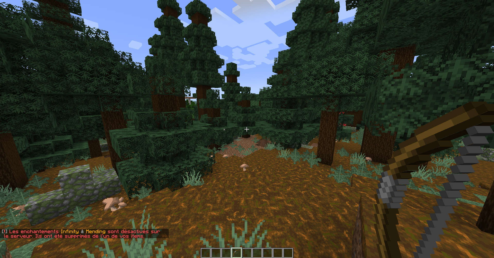

# blacklisted-enchantments

Minecraft plugin which allow Bukkit servers to blacklist enchantments like Mending and Infinity.

## Compatibility & Tested version

This plugin use the Bukkit API maintained by the [Spigot team](https://www.spigotmc.org/) and which
can be found [here](https://hub.spigotmc.org/javadocs/bukkit/).

No tests have been done with the Spigot's Bukkit implementation. Today it's best to turn to
[PaperMC](https://papermc.io/) implementation which give enhanced performances and add some useful
additional tools.

**Tested version for this plugin :** 1.18.x

## How it works

At some events, checks are dispatched to remove and deactivate blacklisted enchantments :
* At preparing enchantment time (when we have an overview of one enchantment in the enchantment 
  table before enchanting item) ;
* At enchant time ;
* At repair time in anvil ;
* At loot time (entity death, chest loot, fish treasure, piglin barting) ;
* At villager trade acquiring (when villager spawn or unlock new trades) ;
* At shoot bow time ;
* At item mend time.

*Note: This plugin take into account enchanting books as well.*

When an item don't have any enchantment anymore after filtering process, the Durability one is
applied automatically. This logic is particularly required at enchant time because giving an item
without any enchantment result to a failure, blocking the player from enchanting the item.
For this reason, it isn't recommended to blacklist this one.

An improvement is possible by adding a re-roll process instead of replacing blacklisted by a
predefined one. The best to achieve this would be to pass through NMS directly.

## Illustration

In this example, when a player shoot with a bow whereas it has Infinity and Mending enchantments,
this item in the hand of the player is updated by removing these blacklisted enchantments.

*Note: the plugin is actually in French, but it will be easy to translate it into another
language thanks to [ResourceBundle](https://docs.oracle.com/javase/8/docs/api/java/util/ResourceBundle.html)
of Java util library and MiniMessage with Adventure API libraries developed and maintained by
[Kyori team](https://docs.adventure.kyori.net/).*

## Setup

First, you need to have set up a Minecraft server with any Bukkit implementation which correspond to
PaperMC or a forked version like Purpur. You can find help about this with the
[PaperMC documentation](https://docs.papermc.io/paper/getting-started).

When it's done, simply download the latest `.jar` file in the
[release section](https://github.com/Djaytan/mc-blacklisted-enchantments/releases/) of this
repository and put it into the `plugins/` folder, and you'll be done! After starting the server,
the plugin should now appear green in the list displayed by the `/plugins` command.

## Licence

This project is under the licence GNU GPLv3.
